# Informe - Taller ASDR y análisis LL(1)

## 1. Introducción

El objetivo de este proyecto es analizar tres gramáticas libres de contexto para estudiar si pueden ser procesadas mediante un Analizador Sintáctico Descendente Recursivo (ASDR). Para ello, se implementó un analizador que elimina recursividad por izquierda y calcula los conjuntos de PRIMEROS, SIGUIENTES y PREDICCIÓN, y además se desarrollaron parsers independientes para cada ejercicio.


## 2. Estructura real del proyecto

La estructura del repositorio es la siguiente:

```text
Taller_ASDR/
├── analizador.py
├── gramatica1.txt
├── gramatica2.txt
├── gramatica3.txt
├── README.md
├── Outputs/
│   ├── Ejecucion1G1.png
│   ├── Ejecucion2G1.png
│   ├── Ejecucion1G2.png
│   ├── Ejecucion2G2.png
│   ├── Ejecucion1G3.png
│   └── Ejecucion2G3.png
└── ASDR_parser/
    ├── gramatica1_asdr_final.py
    ├── gramatica2_asdr_final.py
    ├── gramatica3_asdr_final.py
    ├── entrada_1.txt
    ├── entrada_2.txt
    ├── entrada_3.txt
    └── Outputs/
```

## 3. Metodología general

Para cada gramática se siguió, según el caso, este procedimiento:

1. Leer la gramática desde archivo `.txt`.
2. Eliminar recursividad por izquierda directa o indirecta.
3. Calcular conjuntos de PRIMEROS.
4. Calcular conjuntos de SIGUIENTES.
5. Calcular conjuntos de PREDICCIÓN.
6. Verificar si la gramática resultante es LL(1).
7. Implementar un parser por ejercicio.

## 4. Observación importante sobre las inconsistencias del proyecto

El archivo `analizador.py` trabaja sobre las gramáticas almacenadas en `gramatica1.txt`, `gramatica2.txt` y `gramatica3.txt`. Con ese análisis, las tres gramáticas resultan **no LL(1)** después de eliminar únicamente la recursividad por izquierda.


## 5. Ejercicio 1

### 5.1 Gramática original

```text
S -> A B C
S -> D E
A -> dos B tres
A -> eps
B -> B cuatro C cinco
B -> eps
C -> seis A B
C -> eps
D -> uno A E
D -> B
E -> tres
```

### 5.2 Eliminación de recursividad por izquierda

La recursividad por izquierda aparece en el no terminal `B`:

```text
B -> B cuatro C cinco | eps
```

Aplicando la transformación estándar:

```text
B -> B_P
B_P -> cuatro C cinco B_P | eps
```

Con esto se obtiene una gramática sin recursividad por izquierda.

### 5.3 Resultado del análisis formal

El analizador muestra que, aun después de eliminar la recursividad, la gramática continúa presentando conflicto en `S`, porque las producciones de `S` comparten símbolos en sus conjuntos de predicción. Por tanto, la gramática trabajada directamente desde `gramatica1.txt` **no es LL(1)**.

### 5.4 Qué se podría hacer para volverla LL(1)

Para que el ejercicio 1 pueda analizarse con un ASDR predictivo puro, no basta con eliminar la recursividad por izquierda. Es necesario continuar con **transformaciones manuales adicionales**:

- sustitución de producciones
- expansión de derivaciones
- factorización por la izquierda


### 5.5 Evidencia del análisis

#### Salida del analizador
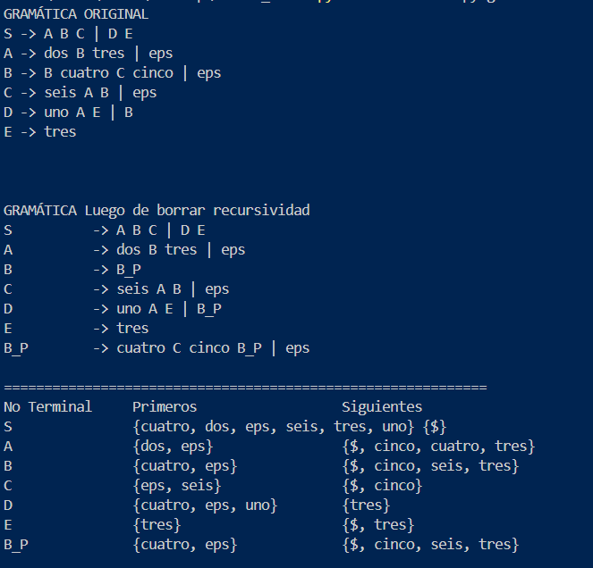

#### Segunda captura de ejecución
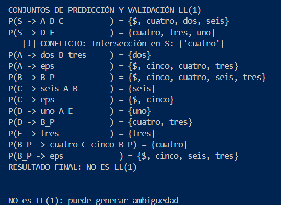

### 5.6 Salidas del parser

#### Cadena aceptada: `dos cuatro cinco tres`
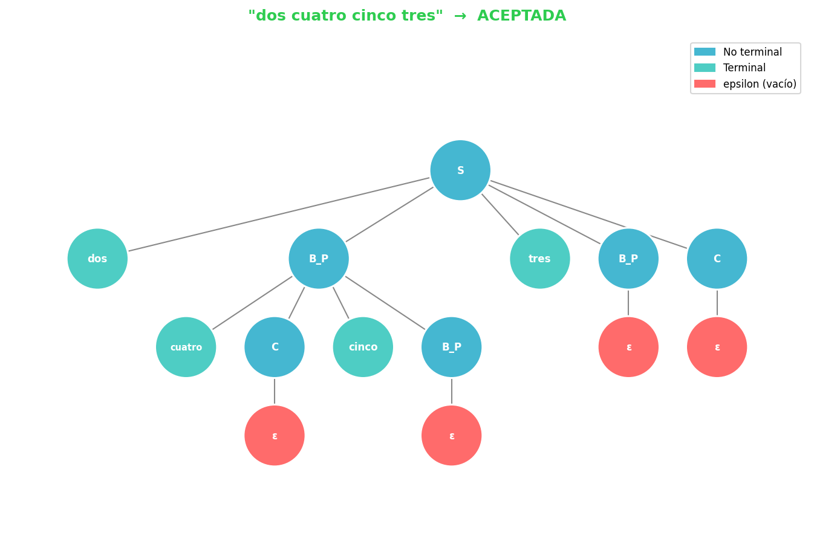

#### Cadena rechazada: `uno tres`
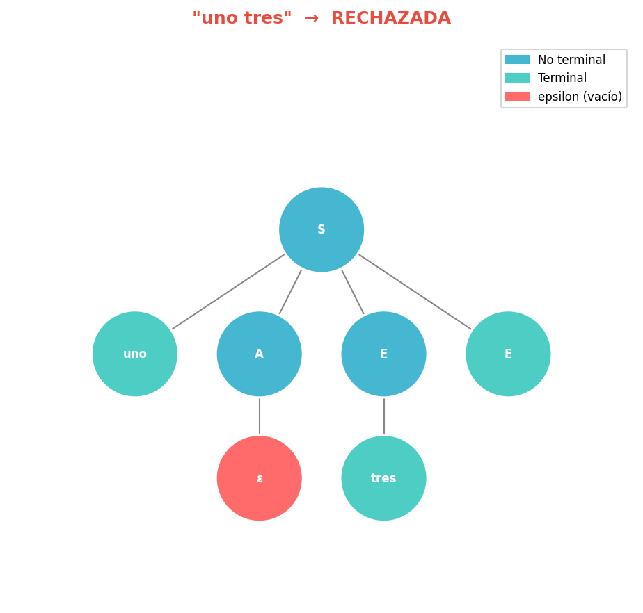

### 5.7 Conclusión del ejercicio 1

- La gramática de `gramatica1.txt`, tras eliminar recursividad, no es LL(1).

## 6. Ejercicio 2

### 6.1 Gramática original

```text
S -> B uno
S -> dos C
S -> eps
A -> S tres B C
A -> cuatro
A -> eps
B -> A cinco C seis
B -> eps
C -> siete B
C -> eps
```

### 6.2 Transformación realizada

En este ejercicio aparece recursividad indirecta por izquierda debido al ciclo entre `S`, `A` y `B`. Para corregirla, se sustituyen producciones hasta convertir la recursividad indirecta en directa y luego se elimina con la transformación estándar.

La gramática usada por el parser queda en la forma:

```text
S   -> B uno | dos C | eps
A   -> B uno tres B C | dos C tres B C | tres B C | cuatro A_P | A_P
A_P -> cinco C seis uno tres B C A_P | eps
B   -> A cinco C seis | eps
C   -> siete B | eps
```

### 6.3 Resultado del análisis formal

Después de eliminar la recursividad, la gramática sigue presentando conflictos en los conjuntos de predicción de varios no terminales. Por lo tanto, **no es LL(1)**.

### 6.4 Qué se podría hacer para volverla LL(1)

En este caso, eliminar recursividad por izquierda no basta. La gramática conserva conflictos debido a:

- anulabilidad por `eps`
- dependencias encadenadas entre `S`, `A` y `B`
- superposición de conjuntos de predicción

Para que llegara a ser LL(1), habría que hacer una reestructuración con factorizacion. En el proyecto actual no se hace eso; en su lugar, el parser resuelve ciertos conflictos de forma manual.

### 6.5 Evidencia del análisis

#### Salida del analizador
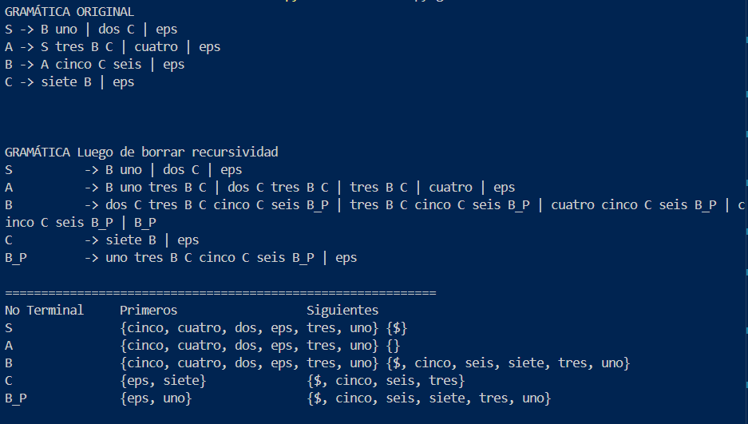

#### Segunda captura de ejecución
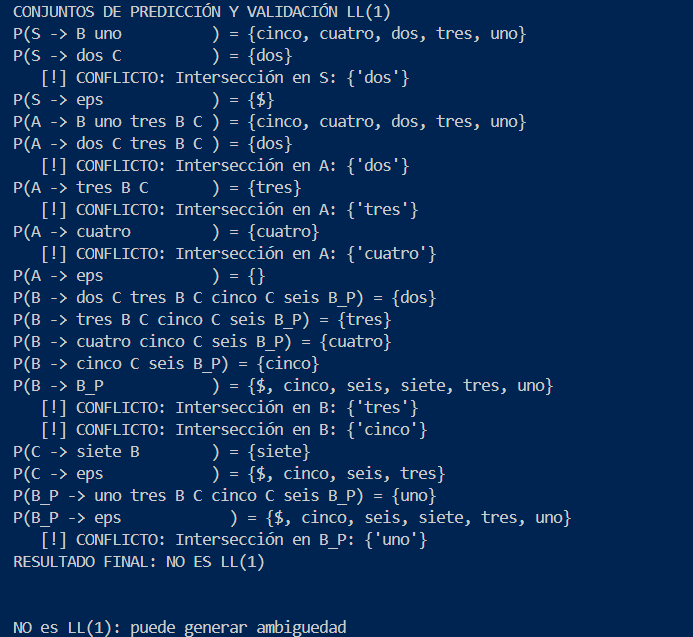

### 6.6 Salidas del parser

#### Cadena aceptada: `uno`
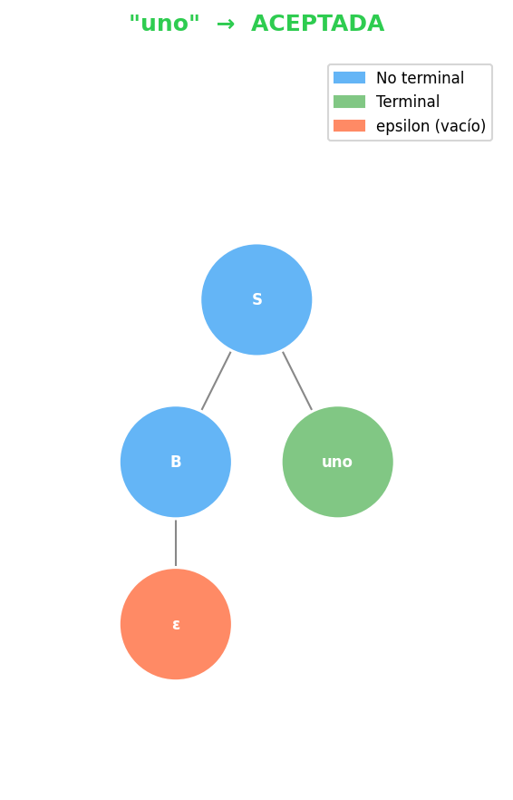

#### Cadena rechazada: `dos cuatro siete`
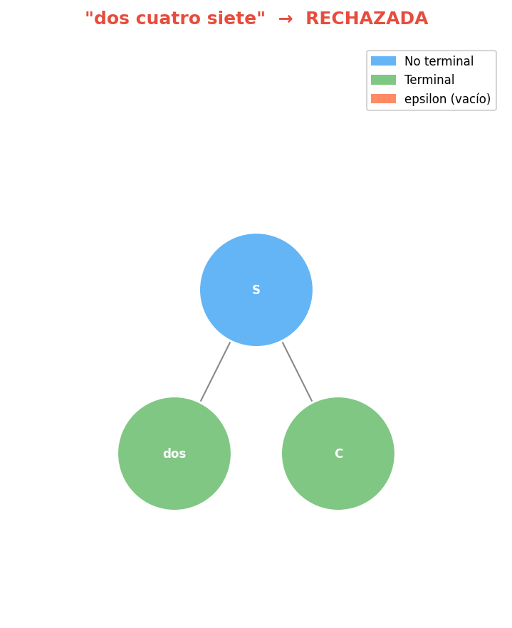

### 6.7 Conclusión del ejercicio 2

- La recursividad indirecta fue eliminada correctamente.
- La gramática resultante no es LL(1).
- El parser del ejercicio 2 incorpora decisiones manuales en puntos conflictivos, especialmente en `S`.

## 7. Ejercicio 3

### 7.1 Gramática original

```text
S -> A B C
S -> S uno
A -> dos B C
A -> eps
B -> C tres
B -> eps
C -> cuatro B
C -> eps
```

### 7.2 Eliminación de recursividad por izquierda

La recursividad por izquierda aparece directamente en `S`:

```text
S -> S uno
```

Se elimina con la transformación estándar:

```text
S -> A B C S_P
S_P -> uno S_P | eps
```

### 7.3 Resultado del análisis formal

Aun después de eliminar la recursividad por izquierda, la gramática sigue presentando conflictos en `B` y `C`, debido a la combinación que aparecen tanto en Primeros como en siguientes. Por eso, **no es LL(1)**.

### 7.4 Qué se podría hacer para volverla LL(1)

En esta gramática, el problema no es solo la recursividad. Los conflictos son estructurales entre `B` y `C`, así que una simple factorización no basta. Para obtener una versión LL(1) sería necesario redefinir el lenguaje o construir una gramática alternativa equivalente, pero eso no se resuelve con transformaciones locales simples.

### 7.5 Evidencia del análisis

#### Salida del analizador
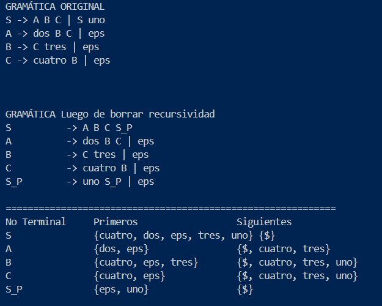

#### Segunda captura de ejecución
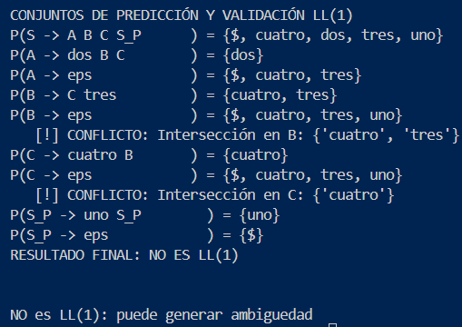

### 7.6 Salidas del parser

#### Cadena aceptada: `dos`
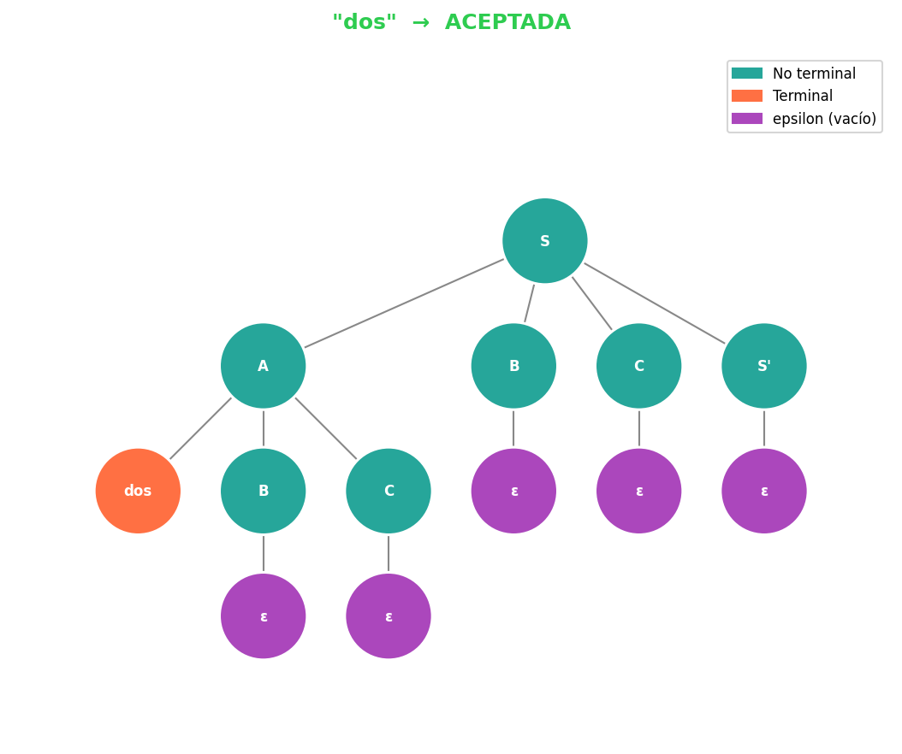

#### Cadena rechazada: `uno`
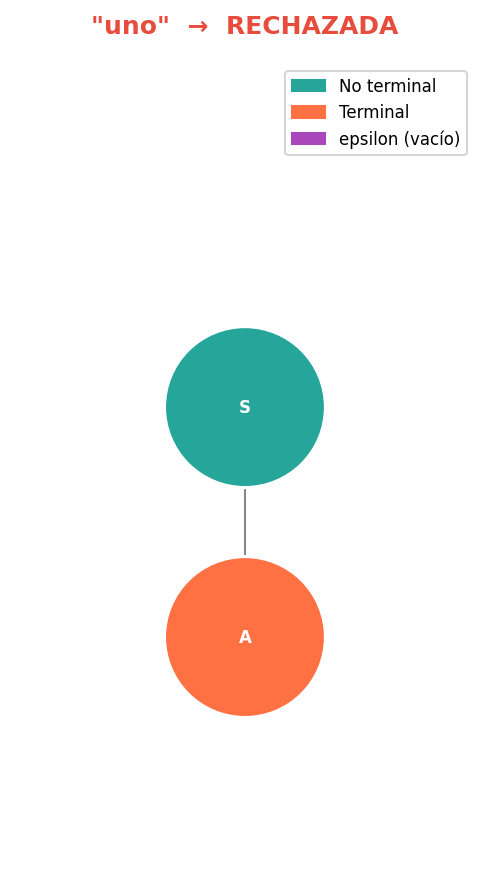

### 7.7 Conclusión del ejercicio 3

- Se eliminó correctamente la recursividad por izquierda en `S`.
- La gramática transformada sigue sin ser LL(1). Se podria lograr aplicando factorizacion y demas transformaciones
- El parser implementa resolución manual de conflictos, priorizando una alternativa en los puntos ambiguos.

## 8. Analizador

El archivo `analizador.py` realiza el análisis formal de las gramáticas:

- lectura desde archivo `.txt`
- impresión de la gramática original
- eliminación de recursividad por izquierda
- cálculo de PRIMEROS
- cálculo de SIGUIENTES
- cálculo de PREDICCIÓN
- validación LL(1)


## 9. Ejecución

### Analizador

```bash
python analizador.py gramatica1.txt
python analizador.py gramatica2.txt
python analizador.py gramatica3.txt
```

### Parsers

Desde la carpeta `ASDR_parser/`:

```bash
python gramatica1_asdr_final.py entrada_1.txt
python gramatica2_asdr_final.py entrada_2.txt
python gramatica3_asdr_final.py entrada_3.txt
```

## 10. Conclusiones generales

- El proyecto sí realiza correctamente la eliminación de recursividad por izquierda en los tres ejercicios.
- El análisis formal muestra que las gramáticas trabajadas desde los archivos `.txt` no son LL(1).
- En los ejercicios 1, 2 y 3 los parsers funcionan como demostración práctica sobre gramáticas no LL(1), usando decisiones manuales en los conflictos.


